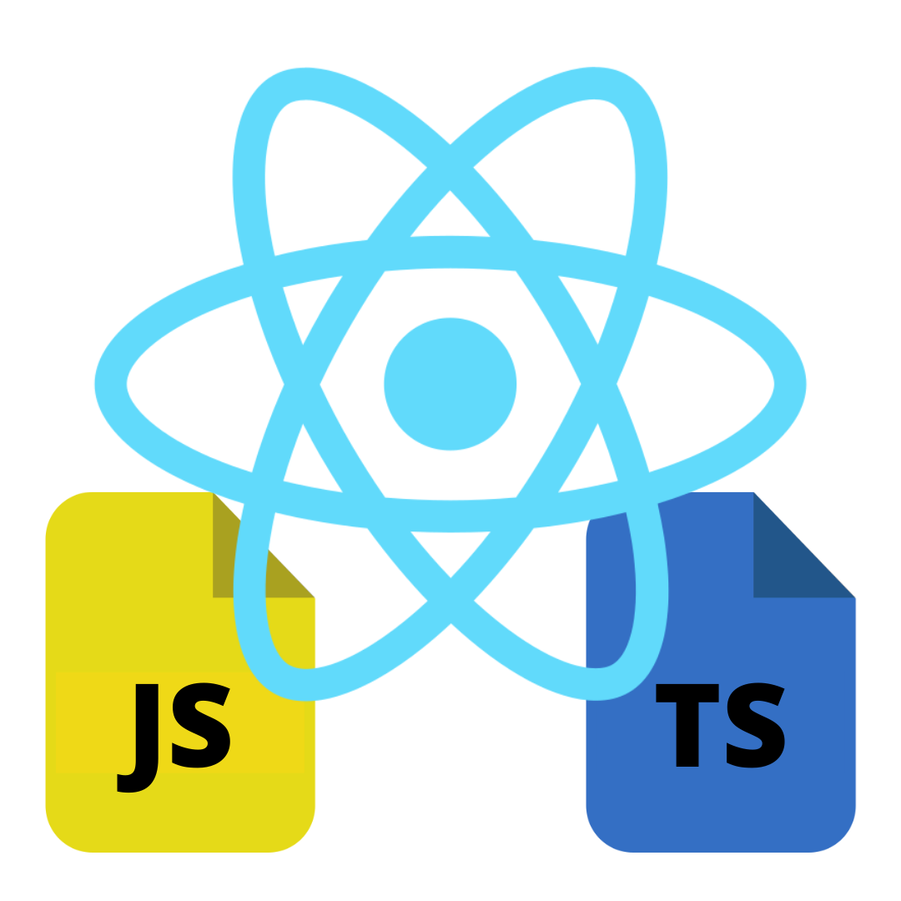

# rn-files-creator
[](https://www.npmjs.com/package/@bachmateus/rn-files-creator)

`rn-files-creator` make it easier to create new React Native components files. It provides a basic file structure for your components with StyleSheet or StyledComponent.



# CAUTION
DO NOT use this project in a production project due to it still being under development

# How to install
You can install via npm:

  ```bash
  npm i -g @bachmateus/rn-files-creator
  ```

# Features
Create React Native files.

1. Create component/screen files using JavaScript.
2. Create component/screen files using TypeScript.
3. Create a config file to store your preferences.

# Project folders structure
`rn-files-creator` use the following project structure to create the component.

  ```bash
  +-- src
      +-- components
          +-- ComponentName
              +-- index.js
              +-- styles.js
      +-- screens
          +-- ScreenName
              +-- index.js
              +-- styles.js
  +-- rn-files-creator.json
  ```


# Usage
The basic use of rn-file-creator is  :
  ```bash
  rn -command componentName [otherComponentName]
  ```

## Creating a Component
Type the following command to create a component 

  ```bash
  rn -c ComponentName
  ```

You can use more than one arg per time to create more than one component

  ```bash
  rn -c ComponentName1 -c ComponentName2 -c ComponentName3 -c ComponentName4
  ```

## Creating a Screen
Type the following command to create a screen 

  ```bash
  rn -s ScreenName
  ```

You can use more than one arg per time to create more than one screen

  ```bash
  rn -s ScreenName1 -s ScreenName2 -s ScreenName3 -s ScreenName4
  ```

## Creating guide
You can follow the guide to create a component if you do not want to type the entire command.

  ```bash
  rn
  ```

After typing enter just follow the guide.


# Command list

| Comand            | Description                                                   |
| ----------------- | ------------------------------------------------------------- |
| -c, --component   | Create one or more components                                 |
| -h, --help        | Show possible commands                                        |
| -s, --screen      | Create one or more screens                                    |


### Known issues
1. It does not work on MacOS.
2. It has not been tested on Linux

# Inspiration
I want to thank DOMINIK KUNDEL. I watched his video to learn how to create a CLI.

https://www.youtube.com/watch?v=s2h28p4s-Xs
https://www.twilio.com/blog/how-to-build-a-cli-with-node-js?utm_source=youtube&utm_medium=video&utm_campaign=node-cli-howto